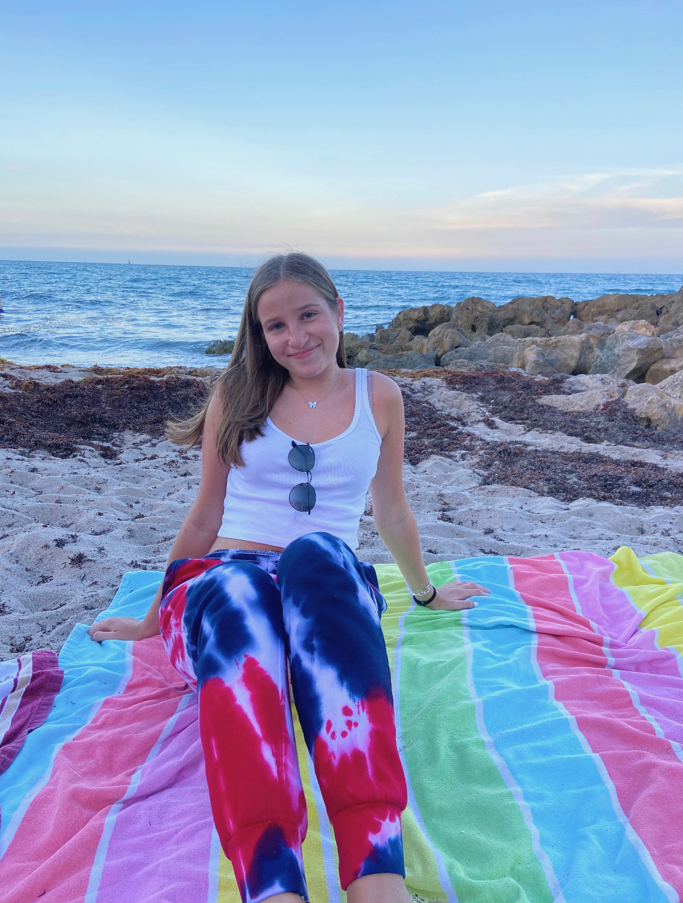

# **Brianna Fisher**

Hi! My name is Brianna Fisher and I am currently a sophomore at the University of Pennsylvania. I am majoring in Criminology and minoring in Survey Research and Data Analytics, with the goal of going to law school. 

This website is a compilation of projects that I have completed in R Studio, demonstrating both my coding and analytic skills. 

